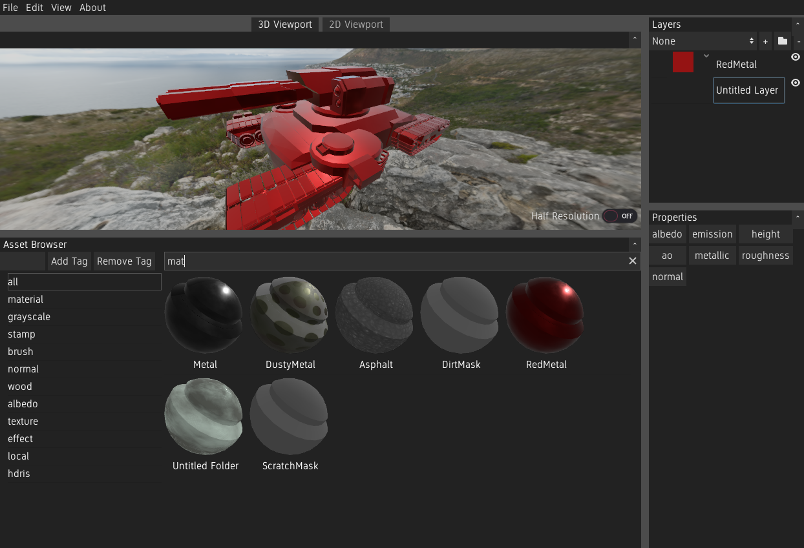

Introduction
============

Material Painter is an open source Substance Painter alternative. It enables the artist to texture 3D models using a non-destructive layer stack, mesh-aware materials, procedural textures and a wide range of painting and selection tools.

