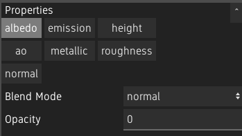
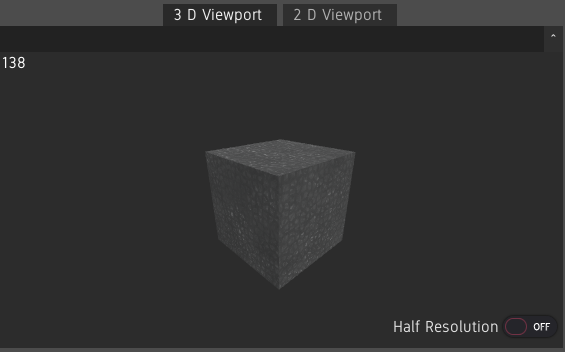
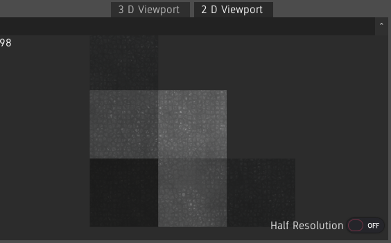
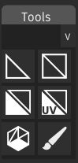
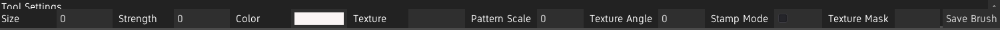

The User Interface
==================

Layers Panel
------------

The layer panel shows the layer stack.

.. image:: images/layer_panel.png

The material can be selected using the dropdown at the top.

To add a new Material Layer, click the ``+`` button. To remove layers, click the ``-`` button. Clicking the ``Add Folder`` button will create a Material Folder or a Texture Folder, depending on if the selected layer is a Material Layer or a Texture Layer.

See :ref:`doc_layer_stack`.

Properties
----------

The properties panel shows the settings of the selected layer. When a Material Layer is selceted, it also shows which channels are enabled.

Asset Browser
-------------

.. image:: images/asset_browser.png

The asset browser shows all types of assets which can be used inside Material Painter. See :ref:`doc_asset_library`.

3D and 2D Viewport
------------------

The viewports shows the loaded model with the created materials applied.

Because the 3D rendering is a bottleneck on many machines, if Material Painter is slow when the viewport is large, ``Half Resolution`` can be enabled on a per-viewport basis to speed up the program.

The FPS counter at the top left can be used to troubleshoot framerate issues.

3D Viewport
~~~~~~~~~~~

Use the middle mouse button to rotate the model, shift + middle mouse button to pan and scroll to zoom.

2D Viewport
~~~~~~~~~~~

The 2D viewport shows the UV map of the model with the material and shading information of the 3D mesh.

The 2D view can be panned with the middle mouse button and zoomed in and out using the mouse wheel.

Environment
~~~~~~~~~~~

The sun can be rotated in each viewport by right clicking and dragging. Shadows can be enabled under ``View>Enable Shadows``. **Note: Shadows can cause a performance hit.**

The background is a solid gray by default. The HDRI can be shown under ``View>Show Background``. The background can also be blurred by a configurable amount under ``View>Background Blur>Amount``. To disable blur, select the ``Amount 0``. To use a different HDRI, drag and drop an HDRI from the asset library onto the viewport. Custom HDRIs can also be imported. See :ref:`doc_asset_library`.

Tools and Tool Settings
-----------------------

The tools and tool settings panel are show when a Bitmap Layer is selected.

The tools panel shows the available tools. A tool can be selected by clicking its icon.

The settings of the selected tool can be configured in the tool settings panel. See :ref:`doc_painting`.

The brush can also be saved as a brush asset by clicking on ``Save Brush``. See :ref:`doc_asset_library`.

Results
-------

The results panel can be shown under ``View>Show Results``. It shows the result of the editing material's channels.

Channels can be isolated by double-clicking the result. The model will temporarily show the selected channel as albedo. To go back to showing all channels, double-click the channel again.

The size of the results can be changed with ctrl and scroll wheel. This size will be saved when saving the layout.

.. image:: images/results.png

Customizing the Interface
-------------------------

Panels can be repositioned by dragging their titles and moving them above another panel. A panel can be dropped on the edges of another panel to put it beside it, or in the middle to create a tabbed panel.

Panels can be "popped out" to make them floating by clicking the ``^`` button next to the title. These floating windows can be resized by dragging on the edges, and popped back in by click the button again.

Layouts can be saved under ``View>Layouts>Save Current`` and loaded by clicking on a layout under ``View>Layouts``. Layouts are saved under ``user://layouts``. The layout named ``default`` is used on startup. If you have overriden the default layout and want to go back to the original, delete or rename the ``default.json`` file under ``user://layouts``.
